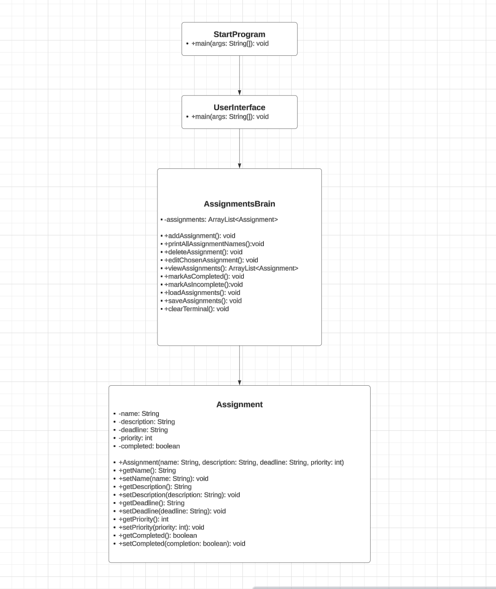

# AssignmentManager project

## Some comments about Makefile
Within the Makefile you can also compile using:
```bash
find $(SRC_DIR) -name "*.java" | xargs javac -cp $(BIN_DIR) -d $(BIN_DIR)
```

## For rendering the Readme.md in VScode
press Ctrl + Shift + V

# My Java Project

This project is a Java program that manages a catalog of assignments, allowing users to add, modify, and remove assignments.

## Table of Contents

- [Introduction](#introduction)
- [Installation](#installation)
- [Usage](#usage)
- [License](#license)
- [UML Diagram](#uml-diagram)

## Introduction

The `AssignmentManager` project is a simple Java program that allows users to manage assignments with details such as name, description, deadline, and priority.

## Installation

### Prerequisites
- Java 11+
- Git

### Steps

1. Clone the repository:
    ```bash
    git clone https://github.com/frederic-marchal/AssignmentManager.git
    ```

2. Navigate to the project directory:
    ```bash
    cd AssignmentManager
    ```

3. Compile the Java files into the `bin` directory using the Makefile:
    ```bash
    make compile
    ```

4. Package the application into a JAR file:
    ```bash
    make jar
    ```

5. Generate Javadoc documentation:
    ```bash
    make javadoc
    ```

## Usage

To run the application from the compiled classes:

```bash
make run
```

To run the application using the JAR file:

```bash
make run-jar
```

## License

This project is licensed under the Apache License 2.0. See the `LICENSE` file for more details.

## UML Diagram


